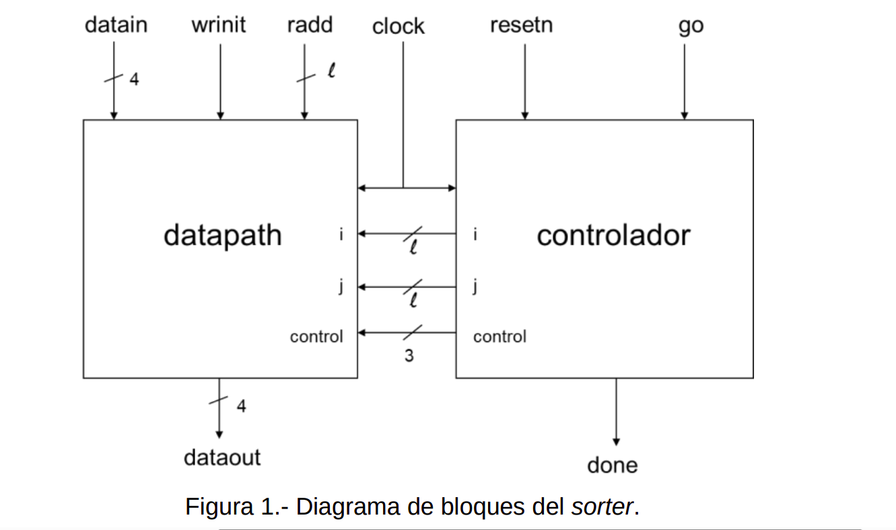
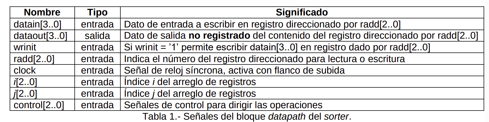
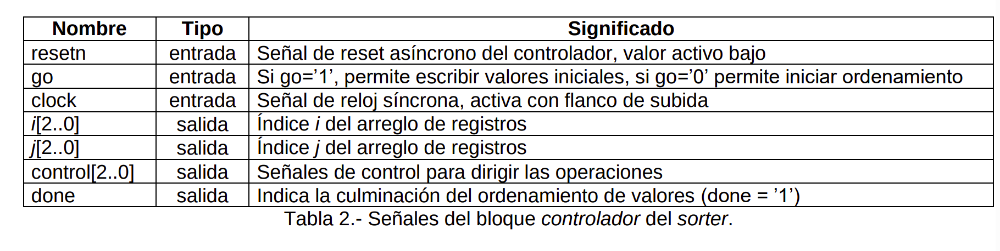
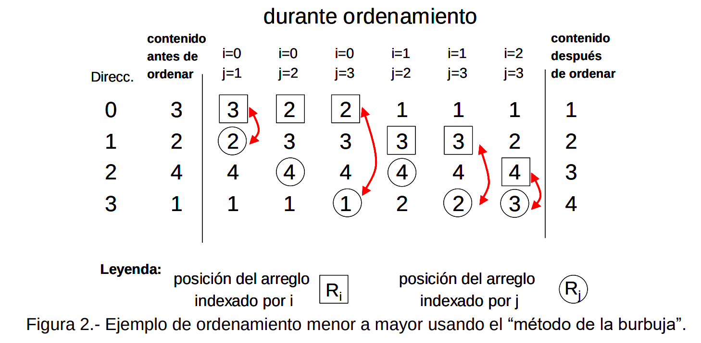
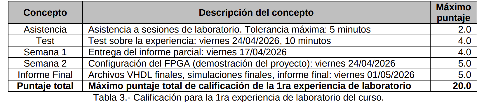

**UNI FIEE 2026-1** 

**UNIVERSIDAD NACIONAL DE INGENIERIA**   
**FACULTAD DE INGENIERIA ELECTRICA Y ELECTRONICA** 

**EE681M – Arquitectura de Computadores de Procesamiento Paralelo 1era. Experiencia de Laboratorio (modalidad presencial)** 

En esta experiencia de laboratorio el estudiante obtendrá experiencia en especificar la descripción a nivel de  comportamiento y estructural de un controlador y camino de datos (datapath) basado en el modelo FSM+D,  usando el lenguaje de descripción de hardware VHDL de la herramienta EDA Quartus Prime de Intel. Igualmente,  el estudiante obtendrá experiencia en configurar y probar el diseño desarrollado en un FPGA. Usar las plantillas  incluidas en el archivo “***templates.zip***” que forman parte de esta experiencia y que se encuentran en el  repositorio digital del curso, en la ruta **/Labs/Lab-01/**. 

Se pide diseñar, simular e implementar un circuito secuencial síncrono que cumpla las funciones de ***sorter***,  utilizando la herramienta de diseño digital Quartus Prime de Intel. Esto es, dado ***k*** números sin signo de **n** bits  almacenados en un juego de registros R0\[(n-1)..0\] a Rk-1\[(n-1)..0\], diseñar el circuito que ordene los números en  **forma ascendente**. Después del ordenamiento, el valor más pequeño debe estar almacenado en el registro R0 y  el valor más grande debe estar almacenado en el registro Rk-1. Para propósitos de la experiencia, **k** \= 8 y **n** \= 4\.  Asumir que ningún valor almacenado en los registros se repite. Diseñar la especificación del circuito en forma  jerárquica, utilizando el lenguaje de descripción VHDL. Se utilizará para esto, un archivo de tope (***sorter.vhd***) y 2  módulos (***datapath.vhd*** y ***controlador.vhd***). Para la implementación del ***sorter***, tomar en cuenta la Figura 1,  donde l\= log2(k). Ver las Tablas 1 y 2 para la explicación de las señales. 

Figura 1.- Diagrama de bloques del *sorter*. 

| Nombre  | Tipo  | Significado |
| ----- | :---: | ----- |
| datain\[3..0\]  | entrada  | Dato de entrada a escribir en registro direccionado por radd\[2..0\] |
| dataout\[3..0\]  | salida  | Dato de salida **no registrado** del contenido del registro direccionado por radd\[2..0\] |
| wrinit  | entrada  | Si wrinit \= ’1’ permite escribir datain\[3..0\] en registro dado por radd\[2..0\] |
| radd\[2..0\]  | entrada  | Indica el número del registro direccionado para lectura o escritura |
| clock  | entrada  | Señal de reloj síncrona, activa con flanco de subida |
| *i*\[2..0\]  | entrada  | Índice *i* del arreglo de registros |
| *j*\[2..0\]  | entrada  | Índice *j* del arreglo de registros |
| control\[2..0\]  | entrada  | Señales de control para dirigir las operaciones |

Tabla 1.- Señales del bloque *datapath* del *sorter*.

| Nombre  | Tipo  | Significado |
| ----- | :---: | ----- |
| resetn  | entrada  | Señal de reset asíncrono del controlador, valor activo bajo |
| go  | entrada  | Si go=’1’, permite escribir valores iniciales, si go=’0’ permite iniciar ordenamiento |
| clock  | entrada  | Señal de reloj síncrona, activa con flanco de subida |
| *i*\[2..0\]  | salida  | Índice *i* del arreglo de registros |
| *j*\[2..0\]  | salida  | Índice *j* del arreglo de registros |
| control\[2..0\]  | salida  | Señales de control para dirigir las operaciones |
| done  | salida  | Indica la culminación del ordenamiento de valores (done \= ’1’) |

Tabla 2.- Señales del bloque *controlador* del *sorter*.

*1ra. Experiencia de Laboratorio EE681M, UNI-FIEE 2026-1 1 de 4*   
El algoritmo a implementar para el ordenamiento de los valores almacenados en los registros es conocido como  el “método de la burbuja”. Un ejemplo de cómo se realiza el ordenamiento de 4 valores se muestra en la Figura  2\. La secuencia de eventos para el funcionamiento del ***sorter*** se explica a continuación. 

El bloque ***controlador*** implementa una máquina de estados finitos (FSM) cuyo estado inicial es S0 (estado de  reset), y tiene los estados S1, S2, etc. Inicialmente, se aplica la señal **resetn \= ’0’**, lo cual produce un reset  asíncrono del ***controlador*** y un borrado síncrono de los registros R0\[ \] a R7\[ \]. Luego, los registros R0\[ \] a R7\[ \] se  inicializan de manera **síncrona**, mientras la señal **go \= ‘1’** (“*modo de inicialización*”) y la señal **wrinit \= ’1’**. Para  esto, se debe indicar el valor a escribir a través de datain\[ \], y la dirección del registro a través de radd\[ \]. Si la  señal **go** cambia a **go \= ’0’** se iniciará el “*modo de procesamiento*”, en el que se procederá al ordenamiento de  los valores almacenados. No será posible regresar al “*modo de inicialización*” una vez que se pasa al “*modo de  procesamiento*”. Una vez terminado el proceso de ordenamiento de valores, aparecerá la señal **done \= ’1’**. A  partir de ese momento se podrá leer el contenido de los registros ordenados. Para esto, se aplicará en radd\[ \] el  número del registro a leer y en dataout\[ \] aparecerá el valor del registro. 

Los valores *i*\[ \] y *j*\[ \] indican índices del arreglo de registros a ser usados en el proceso de ordenamiento. El bloque ***controlador*** implementa una máquina de estado de tal manera que las señales control\[ \] están *codificadas* (en función del estado de la máquina de estado), y permiten realizar las operaciones en el bloque ***datapath***, de forma tal que se estima que son necesarias no más de 3 señales para realizar la inicialización y el procesamiento en el ***datapath***.

Figura 2.- Ejemplo de ordenamiento menor a mayor usando el “método de la burbuja”. 

Todos los registros del sistema serán implementados usando flip-flops tipo **D**. La señal de reloj es común a todos  los registros y flip-flops y se denota como **clock**. La activación de todos los registros y flip-flops será por el flanco  de subida de la señal de reloj **clock**. Para la simulación funcional, ésta se va a realizar sobre el dispositivo de la  familia Cyclone V SoC, 5CSEMA5F31C6 con un período de la señal de reloj de 12 ns y un tiempo de simulación  de 1.5 µs. Deberán realizarse la mayor cantidad posible de selección de valores (sin repetir) para poder apreciar  el comportamiento del sistema. Tomar nota que en el archivo “***templates.zip***” se proporcionan todos los archivos  para esta experiencia de laboratorio. Para esta experiencia de laboratorio se proporcionan los archivos de  Quartus project file (**\*.qpf**), Quartus settings file (**\*.qsf**), Synopsis design constraints (**\*.sdc**), University Program  VWF file (**\*.vwf**) y **\*.tcl**. Estos archivos deben ser usados en su proyecto. Una vez obtenida una compilación  exitosa del proyecto, verificar si en el reporte de compilación generado, ninguna de las categorías está en color  rojo. De haber alguna, es posible que esté relacionada con incumplimiento de restricciones de tiempo. 

El proyecto está sujeto a restricciones de tiempo (*timing constraints*), y usted deberá ejecutar la herramienta  “Timing Analyzer” de Quartus Prime luego de haber compilado el proyecto, a fin de identificar las fuentes de los  problemas de tiempo que están relacionados al estilo de escritura del código VHDL. Para esto, seguir en orden,  las siguientes indicaciones: 

1\) Para ver con un mayor detalle los posibles problemas en su diseño, invocar a la herramienta Timing Analyzer,  seleccionando lo siguiente: Tools 🡪 Timing Analyzer. En la ventana que se abre, ir a la consola de comandos  Tcl (tcl\>), y tipear lo siguiente (sin comillas): “**source timing.tcl**”. Al invocar a este script, se generan  automáticamente una serie de reportes, que aparecen en el reporte de compilación del proyecto como la  categoría **“Timing Analyzer GUI”**, y que le permitirán a usted un mejor análisis de tiempos de su diseño. Ir  directamente a aquellas categorías en color rojo, a fin de realizar un análisis.   
2\) Por ejemplo, en la ventana “**Report**” (parte izquierda del Timing Analyzer) abrir la carpeta de reporte “Report  Timing (I/O)”, y seleccionar “Inputs to Registers (Setup)”. A fin de generar un reporte de diagrama de tiempos  de esta categoría, ir a la ventana “**Tasks**” (parte central izquierda), buscar la categoría “Custom Reports” y  dar doble click a “Report Timing…”. En la ventana que se abre (cuyo nombre es Report Timing), ir a la  categoría **Clocks**, seleccionar la señal ***clock\_input*** para “From Clock:”, y ***clock*** para “To Clock:”. En la  categoría **Targets** de la ventana Report Timing, seleccionar una señal de entrada del reporte “Inputs to  Registers (Setup)” bajo la columna “From Node” haciendo un Ctrl+C, y Ctrl+V en el campo de ingreso de  “From:” de la ventana Report Timing. Bajo la columna “To Node” del reporte “Inputs to Registers (Setup)”,  hacer Ctrl+C, y un Ctrl+V en el campo de ingreso de “To:” de la ventana Report Timing. Como se está 

*1ra. Experiencia de Laboratorio EE681M, UNI-FIEE 2026-1 2 de 4*   
seleccionando generar un reporte de tiempos para Setup, seleccionar “Setup” en la categoría “Analysis Type”.  No modificar el resto de opciones y apretar el botón “Report Timing”. Un resumen de las señales  seleccionadas para el reporte de tiempos, y el reporte de tiempos en forma de diagrama de tiempos se  muestra en la Figura 3\. 

Figura 3.- Generación de reporte de tiempos para "Inputs to Registers (Setup)". 

3\) Si la suma de tiempos “Data Arrival Path” supera a la suma de tiempos “Data Required Path” de la Figura 3,  no se estaría cumpliendo la restricción de tiempos del setup dentro de la categoría “Inputs to Registers  (Setup)”, donde el valor del slack sería negativo, y estaría indicado en color rojo. 

4\) En otro ejemplo, a partir de la carpeta de reporte “Report Timing (I/O)” del Timing Analyzer, seleccionar  “Inputs to Outputs (Setup)”. Un reporte de tiempos similar a la Figura 3, se muestra en la Figura 4\. 5\) Entonces, analizar todas aquellas categorías donde las restricciones de tiempo no se satisfagan, y realizar los  cambios en el diseño para cumplir con las restricciones de tiempo. 

Figura 4.- Generación de reporte de tiempos para "Inputs to Outputs (Setup)" 

**Para la presentación del informe parcial:** 

∙ Para cada grupo de laboratorio, esbozar la especificación de hardware de los módulos ***datapath*** y  ***controlador*** por separado, utilizando el lenguaje VHDL. 

∙ Realizar simulaciones funcionales preliminares de los módulos ***datapath*** y ***controlador*** por separado. ∙ Presentación del informe parcial: en la primera semana de iniciada la presente experiencia de laboratorio.

*1ra. Experiencia de Laboratorio EE681M, UNI-FIEE 2026-1 3 de 4*   
**Para la presentación del informe final:** 

∙ Para cada grupo de laboratorio, dar la especificación completa del diseño jerárquico de hardware del ***sorter***,  utilizando el lenguaje VHDL. 

∙ Comprobar el funcionamiento del ***sorter*** realizando las simulaciones funcionales utilizando el dispositivo  Cyclone V SoC 5CSEMA5F31C6, un período de 12 ns para la señal de reloj y tiempo de simulación de 1.5 µs, usando el archivo **Waveform.vwf** proporcionado. Presentar en el Informe Final, los resultados de la  simulación funcional, indicando una variedad de valores de ingreso y secuencias de señales internas, como el  estado de la FSM y registros internos. Por el dispositivo seleccionado (Cyclone V SoC), no será posible  realizar una simulación de tiempos del proyecto. 

∙ ¿Es posible cumplir con las restricciones de tiempo impuestas para el diseño? De no ser así, indicar donde  hay incumplimientos de tiempo, y las posibles razones del incumplimiento. 

∙ Dar la expresión (en función del período de reloj, y en función de la cantidad de registros) de cuánto tiempo  demora ordenar todos los datos cuando están inicialmente ordenados de mayor a menor. ∙ Adjuntar todos los archivos generados por la herramienta EDA Quartus Prime, resultado del diseño del  circuito secuencial solicitado. 

∙ Responder a las siguientes peguntas (a partir del reporte **Timing Analyzer GUI**): 

∙ ¿Cuál es el valor de **FMAX** que reporta la herramienta? 

∙ Del **Datasheet Report**: ¿Cuáles son los valores de Setup Times, Hold Times, Clock to Output Times? ∙ Del **Report Timing I/O**: ¿Cuáles son los menores valores de slack time para las categorías Inputs to  Registers (Setup), Inputs to Registers (Hold), Inputs to Registers (Recovery), Inputs to Registers  (Removal), Registers to Outputs (setup), Registers to Outputs (Hold), Inputs to Outputs (Setup) e Inputs to  Outputs (Hold), y entre qué nodos (ver columnas “From Node” y “To Node” en cada categoría)? ∙ Las observaciones y conclusiones generadas por la realización de la experiencia de laboratorio. 

**Notas Generales para toda la experiencia:** 

∙ Un nuevo estado comienza con un flanco de subida de la señal de reloj. 

∙ Se solicita usar la versión 18.1 de Quartus Prime Lite Edition de Intel para el desarrollo del laboratorio. ∙ Fecha de inicio de la experiencia: a partir del viernes 17/04/2026. 

∙ Duración de la experiencia: dos (02) sesiones consecutivas. 

∙ Fecha de entrega del informe parcial: viernes 17/04/2026. 

∙ Finalización de la experiencia: viernes 24/04/2026. 

∙ Fecha de entrega del informe final: viernes 01/05/2026 (solo entrega de Informes, pero **NO** realización de la  experiencia). 

∙ La forma de entrega de los informes y archivos generados por el software EDA Quartus Prime será vía el  **aula virtual de la UNI**. 

∙ La calificación para esta experiencia de laboratorio es la que se muestra en la Tabla 3\. 

| Concepto  | Descripción del concepto  | Máximo puntaje |
| :---: | ----- | ----- |
| Asistencia  | Asistencia a sesiones de laboratorio. Tolerancia máxima: 5 minutos  | 2.0 |
| Test  | Test sobre la experiencia: viernes 24/04/2026, 10 minutos  | 4.0 |
| Semana 1  | Entrega del informe parcial: viernes 17/04/2026  | 4.0 |
| Semana 2  | Configuración del FPGA (demostración del proyecto): viernes 24/04/2026  | 5.0 |
| Informe Final  | Archivos VHDL finales, simulaciones finales, informe final: viernes 01/05/2026  | 5.0 |
| **Puntaje total**  | **Máximo puntaje total de calificación de la 1ra experiencia de laboratorio**  | **20.0** |

Tabla 3.- Calificación para la 1ra experiencia de laboratorio del curso.

∙ El formato de entrega incluirá un archivo **zip** (o **rar**) que contiene **todo el diseño completo**, es decir **todos  los archivos generados** por la herramienta Quartus Prime, y el informe en formato **Word** ó **PDF**. Las figuras  grandes a ser incluidas en los informes, por ejemplo las simulaciones, presentarlas a una sola columna. ∙ El nombre del archivo **zip** (o **rar**) debe tener la siguiente nomenclatura:  

Lab-0X\-Informe-YZ\-Grupo-W.zip, debiendo reemplazar 0X por 01, 02, etc., con el número de la experiencia,  YZ con Previo o Final, y W con el número del grupo asignado (1, 2, etc.), respectivamente. Los archivos se  subirán al Aula Virtual UNI en las fechas indicadas. 

∙ De haber retraso en la entrega del informe parcial, se calificará con **CERO (0.0)** de **CUATRO (4.0)** puntos  dentro de la calificación final de esta experiencia. 

∙ De haber retraso en la entrega del informe final, se calificará con **CERO (0.0)** de **CINCO (5.0)** puntos dentro  de la calificación final de esta experiencia. 

∙ Presentar los Informes de acuerdo a la forma sugerida en el documento “NORMAS PARA LA  PRESENTACION DE INFORMES DE LABORATORIO DE ARQUITECTURA DE COMPUTADORES DE  PROCESAMIENTO PARALELO – EE681M”, que se ha subido al repositorio digital del curso. 

∙ El formato de presentación del informe final en formato IEEE es opcional, pero no es recomendable. ∙ Adherirse al “Código de Honor” del curso, el cual también se ha subido al repositorio digital del curso.  Cualquier violación a dicho código será sancionado. 

El profesor Lima, 09 de Abril de 2026 Ing. A.M.V., PhD.

*1ra. Experiencia de Laboratorio EE681M, UNI-FIEE 2026-1 4 de 4* 

